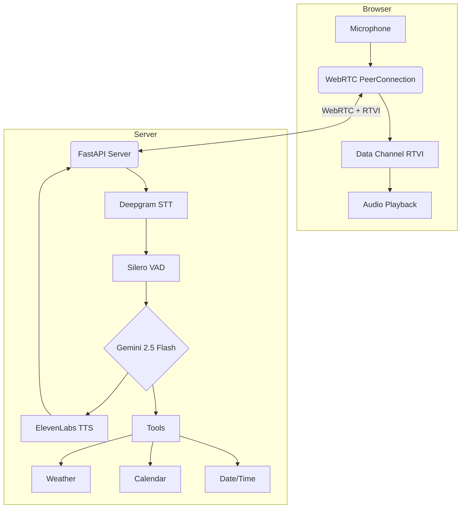

## Browser Based Voice Assistant

A minimal real-time voice-to-voice AI assistant that runs entirely in the browser. Using WebRTC for low-latency audio streaming with integrated tools for weather, calendar, and time queries.

### Architecture



### Features

**Voice Interaction:**
- Real-time speech-to-speech conversation
- Multilingual support (Deepgram Nova-3 multi-language model)
- Natural voice synthesis with ElevenLabs
- Voice Activity Detection (Silero VAD)
- Interrupt handling during responses

**Integrated Tools:**
- **Weather** - Get current weather for any location worldwide
- **Calendar** - Fetch and create Google Calendar events
- **Date/Time** - Current time, date calculations, IST timezone

**Security:**
- JWT authentication with 7-day token expiry
- reCAPTCHA v3 bot protection
- Password hashing with bcrypt

### Tech Stack

| Component | Technology |
|-----------|------------|
| Server | FastAPI, Uvicorn |
| Voice Pipeline | Pipecat |
| STT | Deepgram Nova-3 |
| LLM | Google Gemini 2.5 Flash |
| TTS | ElevenLabs |
| Transport | WebRTC (SmallWebRTC) |
| Frontend | Vanilla JS, Tailwind CSS |
| Auth | JWT, bcrypt, reCAPTCHA v3 |

### Voice Pipeline (Pipecat)

```
Audio In → VAD → STT → LLM Context → LLM → TTS → Audio Out
              ↓                        ↓
         Silero VAD              Tool Execution
         (0.75 conf)             (Weather, Calendar)
```

| Parameter | Value |
|-----------|-------|
| VAD Confidence | 0.75 |
| VAD Stop Secs | 0.80 |
| STT Model | nova-3 (multi-language) |
| LLM Temperature | 0.5 |
| TTS Stability | 0.80 |
| TTS Speed | 1.0x |

### Installation

**1. Clone and setup**

```bash
git clone https://github.com/shivsinghin/voice-agent.git
cd voice-agent
python -m venv venv
source venv/bin/activate  # Windows: venv\Scripts\activate
pip install -r requirements.txt
```

**2. Configure environment**

Create `.env` file:

```env
# API Keys
DEEPGRAM_API_KEY=your_deepgram_key
GOOGLE_API_KEY=your_google_key
GEMINI_MODEL_ID=gemini-2.0-flash
ELEVENLABS_API_KEY=your_elevenlabs_key
ELEVENLABS_VOICE_ID=your_voice_id
ELEVENLABS_MODEL_ID=eleven_multilingual_v2

# Auth
JWT_SECRET_KEY=your_secret_key
ADMIN_USERNAME=admin
ADMIN_PASSWORD=your_password

# Optional: reCAPTCHA
RECAPTCHA_SECRET_KEY=your_secret
RECAPTCHA_SITE_KEY=your_site_key
```

**3. Google Calendar setup (optional)**

Create `token.json` with OAuth credentials for Calendar API access.

**4. Run server**

```bash
python server.py
```

Open http://localhost:8000 in your browser.

### Project Structure

```
Voice-Agent/
├── server.py           # FastAPI server, auth, WebRTC signaling
├── agent.py            # Pipecat voice pipeline configuration
├── tools/
│   ├── __init__.py     # Auto-discovery exports
│   ├── register.py     # Tool registration system
│   ├── weather.py      # Weather tool
│   ├── calendar.py     # Google Calendar tools
│   ├── date.py         # Date calculations
│   └── time.py         # Current time tool
├── public/
│   ├── index.html      # Login + voice interface UI
│   └── script.js       # WebRTC client, RTVI protocol
└── requirements.txt
```

### API Endpoints

| Method | Endpoint | Auth | Description |
|--------|----------|------|-------------|
| GET | `/` | No | Serve web interface |
| POST | `/api/login` | No | JWT authentication |
| POST | `/api/verify-token` | Yes | Validate JWT token |
| GET | `/api/recaptcha-config` | No | Get reCAPTCHA site key |
| POST | `/api/offer` | Yes | WebRTC SDP offer/answer |

### Adding Custom Tools

Create a new file in `tools/` directory:

```python
from pipecat.adapters.schemas.function_schema import FunctionSchema
from pipecat.services.llm_service import FunctionCallParams

SCHEMA = FunctionSchema(
    name="my_tool",
    description="Tool description for the LLM",
    properties={
        "param": {"type": "string", "description": "Parameter description"}
    },
    required=["param"]
)

FUNCTION_NAME = "my_tool"

async def handler(params: FunctionCallParams):
    result = params.arguments.get("param")
    await params.result_callback({"result": result})
```

Tools are automatically discovered and registered.

### License

MIT
